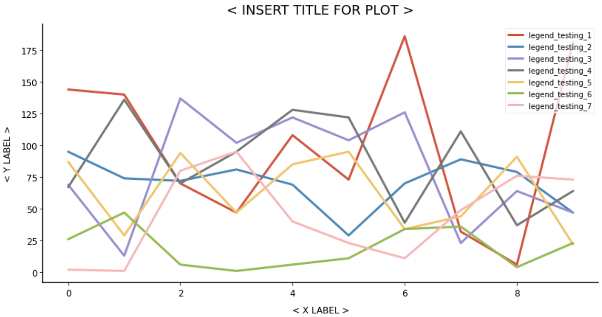

# Plotting Style Sheet

Style sheet created to produce consistent plots in all of my projects using Python package [Matplotlib](https://github.com/matplotlib/matplotlib).

## Example Output:
Example output of a line chart using the style sheet:

